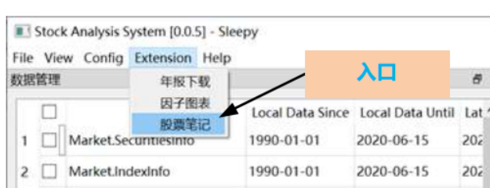
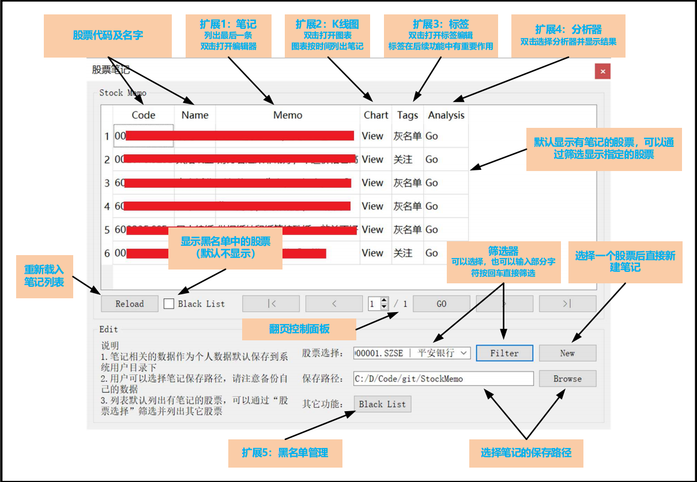

# StockAnalysisSystem
This program is designed for Chinese market and Chinese accounting policies (currently). So this document will only provide Chinese version.
  
# Gitee
https://gitee.com/SleepySoft/StockAnalysisSystem  
  
# Github
https://github.com/SleepySoft/StockAnalysisSystem  
  
# 网盘下载：
应网友要求，对于网络访问受限的用户，提供网盘下载（离线数据同样在此下载）：  
链接: https://pan.baidu.com/s/1Xv3hq09-0-zAgJEk8dd4Gg  
提取码: r11g  
  
# 视频讲解  
安装配置：https://www.bilibili.com/video/BV14z411b7AE/  
设计与框架：https://www.bilibili.com/video/BV1nK411p7uD/
  
# 最近更新内容：  
重新设计数据存储以期望提高速度  
  
# 运行环境  
* 由于图表引入了pyqtgraph，导致pyinstaller打包出现问题，并且尝试py2exe也不成功，故暂停以EXE形式发布Release  
  
## 只想看结果  
* 打开analysis_report.xlsx  
  
## 大神看这里  
* 需要安装MongoDB  
* Python3.7，推荐Anaconda  
* requirements.txt你们懂的  
* 从main.py运行  
  
## 新手看这里  
* 从网盘下载MongoDB及Anaconda并安装  
* 按WIN键，输入：“cmd”，选择用管理员运行命令行  
* 在命令行中执行命令：“conda create -n sas python=3.7”，需要确认就输入y回车  
* 如果提示找不到conda，请参考这篇文章，将你的anaconda加入到系统目录中：https://blog.csdn.net/u013211009/article/details/78437098  
* 如果一切正常，运行命令：“conda activate sas”，这时你的命令行会出现(sas)字样  
* 执行以下命令切换到代码目录：“cd "你的代码目录"”比如：cd "D:\Code\git\StockAnalysisSystem"  
* 切换到代码目录后运行命令：“pip install -r requirements.txt -i https://pypi.tuna.tsinghua.edu.cn/simple”  
* 如果提示pip版本太旧，按提示运行命令：“python -m pip install --upgrade pip -i https://pypi.tuna.tsinghua.edu.cn/simple” 完成后再执行上一条命令  
* 最后一步，运行命令：“python main.py”  
------------------------------------------------------------  
* 以后运行只需要打开cmd并切换到代码目录（一个简单的方法，用文件管理器打开代码目录，在上方的地址栏直接输入cmd回车即可）  
* 先运行命令：“conda activate sas”  
* 再运行命令：“python main.py”  
  
# 软件配置  
当软件没检测到配置文件，会自动弹出配置窗口，配置如下：  
* NoSql相关  
> 如果按默认安装，不需要改。否则根据实际情况修改mongodb配置。  
* Ts Token  
> 如果不需要更新可以随便乱填，需要更新的话：  
> 注册一个tushare的账号：https://tushare.pro/register?reg=271027  
> 想办法获取500以上的积分（如果没有，无法更新数据，但可以使用离线数据）：https://tushare.pro/document/1?doc_id=13  
> 获取你的token并填入配置界面：https://tushare.pro/document/1?doc_id=39  
* MongoDB Bin  
> 只和导入导出有关，选择本机的MongoDB的bin文件目录（默认目录大同小异，一般只是版本号不同）  
> 从度盘下载离线数据（当前代码选择2.0的数据，唯一区别就是日数据每股一个表还是全部存在一个表中）并解压  
> 挨个选择目录导入（StockAnalysisSystem，StockDaily，SasCache；顺序无关，后两个可选）  
> 导入时下方会显示导入进度，如果没反映，请检查MongoDB目录是否正确  
* Proxy  
> 只是为了我使用方便，没有的话就别管了  
* 以上步骤都做完后，建议重新程序（非必须），或手动刷新一下列表  
  
# 联系作者
如果有任何意见及建议，或者对此项目感兴趣的，请联系我：  
微博：SleepySoft  
邮箱：sleepysoft##163.com  
QQ群：931499339，进群验证码：SleepySoft  
如果遇到BUG，可以给我发邮件，或直接在git上提交issue  
  
----------------------------------------------------------------------------------------------------------------------
  
# 本程序的目的  
1. 自动选择合适的数据抓取模块和数据源下载所需要的数据  
2. 数据抓取模块能够进行有效性检测，并且能够方便地扩充和替换，可以通过适配器接入其它的库  
3. 增加一个数据源以及将其本地化所需的代码应尽可能少  
4. 能进行离线分析  
5. 分析模块（策略模块）应该可以动态扩充和组合  
6. 最终能生成矩阵式excel报告：以证券为行，以分析方法为列，相交点为此分析方法对此证券的评分；最后一列为该证券的总分  
  
----------------------------------------------------------------------------------------------------------------------
  
# 功能说明  
  
## 主要功能  
* 报告格式说明  
  
报告为表格矩阵，以股票代码为列，以分析算法为行，相交格子为该算法对此股票的评分（0 - 100）  
> 0：VETO  
> 1 -50：FAIL  
> 51 - 75：FLAW  
> 76 - 90：WELL  
> 91 - 100：PASS  
  
结果分为两页，第一页为评分，第二页为分析算法输出的详细信息，以供人工核对及查阅  
绿色为PASS，红色为FAIL，灰色为不适用，或因数据缺失导致无法分析  
最后一列为总评分，在一行中，只要有一个评分为FAIL，则总评分为FAIL；如果不存在FAIL但存在灰色结果，则总评分为灰色的PASS  
当前分析算法还不够完善，结果仅供参考，遇到和自己分析存在偏差的情况，请参阅详细信息并进行人工复核  
  
## 扩展功能  
  
* Stock Memo  
  

  
----------------------------------------------------------------------------------------------------------------------
  
# 开发计划：
  
* 接入更多数据  
> 限售股解禁: https://tushare.pro/document/2?doc_id=160  
> 回购数据  
> 增减持数据: https://tushare.pro/document/2?doc_id=175  
> 实际控制人数据（巨潮）: http://webapi.cninfo.com.cn/#/dataBrowse?id=266  
* 加入更多分析算法  
> 量价分析  
* 整合测试入口，执行一个文件即可运行所有测试  
* 加入实时数据  
* 盯盘  
* 投资图谱  
* 做成WebService，通过APP操作  
